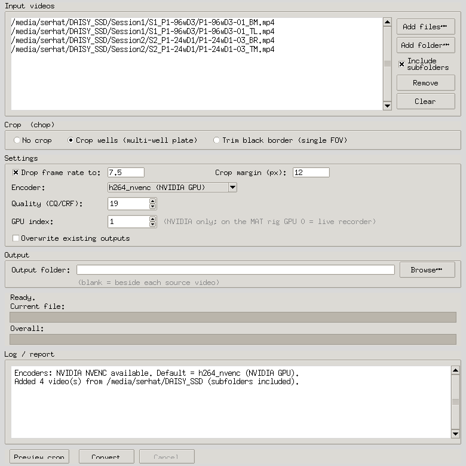

# 🪓 Chop & Drop

> *"Chop the wells, drop the frames."*

A small, self-contained desktop GUI for batch-preparing microscopy / behavioural
recordings for analysis. Pick a **crop** option and optionally **drop the frame
rate**; they combine in a single GPU pass.

- **Drop frames**: re-encode to a lower frame rate (e.g. **25 → 7.5 fps**) while
  keeping the **same duration** (frames are dropped, playback is *not* slowed down).
- **Chop wells**: split a multi-well plate (96 / 24 / 6-well) into **one video per
  well**, with the grid auto-detected.
- **Trim black border**: when cameras have different fields of view, auto-detect the
  bright imaged area and trim the black surround, leaving a small margin.

Encoding uses your GPU when possible, with a CPU fallback. The app **auto-detects
which encoders your FFmpeg has at startup** and only offers those, defaulting to the
fastest available.

## Platform support

Runs on **Windows, macOS, and Linux** (it's pure Python + FFmpeg). What differs is
the acceleration:

| Platform | Acceleration | Notes |
|----------|--------------|-------|
| Windows / Linux **with NVIDIA GPU** | NVDEC decode + **NVENC** encode | Fastest; default `h264_nvenc`. Needs an NVENC-enabled FFmpeg build. |
| **macOS** (Apple Silicon or Intel) | **VideoToolbox** encode | No NVENC on Macs; the app offers `h264_videotoolbox` automatically. |
| Any machine **without a supported GPU** | **CPU** (`libx264` / `libx265`) | Works everywhere, just slower. |

You never have to pick manually; unavailable encoders simply don't appear in the
dropdown, and the default is the best one your machine supports.



---

## Requirements

- **Python 3.8+** with **Tkinter** (ships with python.org installers and most
  Linux `python3-tk` packages; included in Anaconda/Miniconda).
- **NumPy** and **OpenCV** (`opencv-python`); see install below.
- **FFmpeg** on your `PATH` (or at `/usr/bin/ffmpeg`).
  - For GPU encoding you need an **NVIDIA GPU** and an FFmpeg build with
    **NVENC/NVDEC** (`h264_nvenc` / `hevc_nvenc`). Check with:
    ```bash
    ffmpeg -hide_banner -encoders | grep nvenc
    ```
  - No NVIDIA GPU? Choose the **`libx264 (CPU)`** encoder in the GUI; everything
    still works, just on the CPU.

## Install

```bash
git clone https://github.com/serhat-turkmen/chop-and-drop.git
cd chop-and-drop
pip install -r requirements.txt
```

Install FFmpeg if you don't have it:

```bash
# Debian/Ubuntu
sudo apt install ffmpeg python3-tk
# macOS (Homebrew)
brew install ffmpeg
# Windows: download from https://ffmpeg.org and add it to PATH
```

> NVENC is only present in FFmpeg builds compiled with the NVIDIA codecs. The
> distro packages on Linux usually include it; on Windows use a "full"/gpl build.

### Optional: install as a command

```bash
pip install .
chop-and-drop      # launches the GUI
```

## Run

```bash
python chop_and_drop.py
```

…or, if you installed it as a package, just run `chop-and-drop`.

On Linux you can also use the included **`Chop & Drop.desktop`** launcher (edit the
`Exec=`/`Path=` lines to match where you cloned the repo, then mark it executable).

---

## Usage

1. **Add videos**: *Add files…* or *Add folder…*. With **Include subfolders**
   ticked (default) it recursively finds every video in all nested subfolders and
   processes them one by one.
2. **Choose a crop**: *No crop*, *Crop wells*, or *Trim black border*.
3. **(Optional) Drop frame rate**: tick the box and set the target fps (default 7.5).
4. **Preview crop**: overlays the detected wells / content box on a frame so you can
   confirm detection and tune the margin before committing.
5. **Convert.**

| Crop choice | + Drop FPS? | Output |
|-------------|-------------|--------|
| **No crop** | required | `name_7.5fps.mp4` (whole frame, re-timed) |
| **Crop wells** | optional | `name/name_well01[_7.5fps].mp4 …` + `name_wells.csv` |
| **Trim black border** | optional | `name_trim[_7.5fps].mp4` |

Outputs go beside each source video, or into a single **Output folder** if you set
one. Each run also writes a `conversion_report.txt`.

### Settings

| Setting | Meaning |
|---|---|
| **Drop frame rate to** | Target fps (frames dropped, duration preserved). |
| **Crop margin (px)** | Grows each crop box outward by N px (keeps edge worms / leaves a little black border). Negative shaves inward. Width/height are forced even (yuv420p). |
| **Encoder** | Auto-detected list (NVENC / VideoToolbox / libx264 / libx265); defaults to the fastest your machine supports. |
| **Quality (CQ/CRF)** | Lower = better quality / larger file. Default 19. |
| **GPU index** | Which NVIDIA GPU to use (pinned via `CUDA_VISIBLE_DEVICES`). |
| **Overwrite** | Off by default; existing outputs are skipped (resumable). |

---

## How detection works

Both detectors take the **median of ~15 frames** (removes moving subjects, leaves
the static scene) and Otsu-binarise it.

- **Wells**: bright well bands are found by row/column projection; partial edge wells
  (< 60 % of the median full-well span) are dropped.
- **Border trim**: the outer extent of the bright region (ignoring rows/cols that are
  < 2 % bright) becomes the content box; the margin is then added.

Frame-rate reduction uses FFmpeg's `fps` filter, which drops frames to hit the target
rate **without** changing the duration.

## Working with external drives

Recordings often live on an external SSD/HDD. macOS/Windows mount these
automatically; on Linux they usually auto-mount under `/media/<you>/<LABEL>` but can
need a manual step. See **[docs/mounting-external-drives.md](docs/mounting-external-drives.md)**
for a step-by-step guide (identify, mount, permissions, safe-eject, troubleshooting).

## Notes

- Cropping a 96-well plate produces ~96 simultaneous NVENC outputs in one decode
  pass. This is fine on workstation GPUs (no encoder-session limit); on consumer
  GeForce cards (limited concurrent NVENC sessions) switch the encoder to
  `libx264 (CPU)` if you hit a limit.
- On NVIDIA GPUs, decoding runs on **NVDEC** (the `*_cuvid` decoders) so the CPU
  stays nearly free; if a particular clip can't GPU-decode, it automatically
  retries that file with software decode. On a 4K clip this is roughly 1.5x faster
  than software decode and frees about 9 CPU cores.
- One job already saturates the GPU's single NVENC engine, so running several jobs
  on the *same* GPU does not speed things up. To go faster, use a second GPU.
- The tool calls `ffmpeg`/`ffprobe` from your `PATH` (preferring `/usr/bin/ffmpeg`).

## License

MIT. See [LICENSE](LICENSE).
